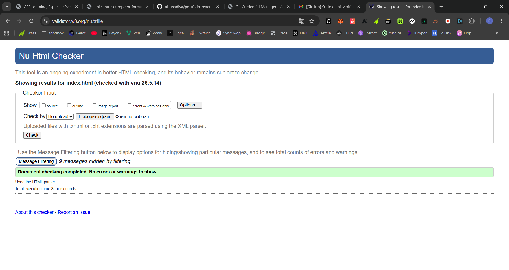
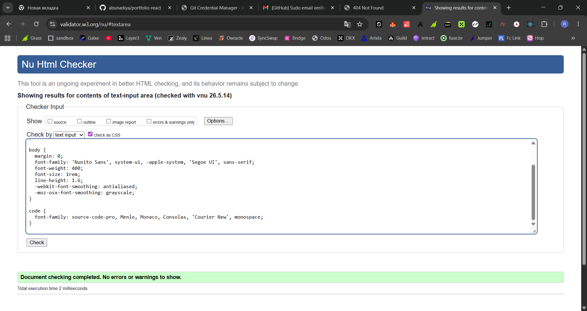

# Portfolio de John Doe
Ce projet est un site vitrine professionnel développé avec React 18 et Bootstrap 5. Il a été réalisé dans le cadre d'un projet d'études pour présenter les compétences et les réalisations d'un développeur web.
## 🚀 Fonctionnalités
 * Accueil : Présentation générale et services.
 * Portfolio : Affichage dynamique des projets via l'API GitHub.
 * Contact : Formulaire fonctionnel utilisant les React Hooks (useState).
 * Responsive Design : Entièrement adaptable sur mobile et tablette grâce à Bootstrap.
## 🛠 Technologies utilisées
 * React.js
 * Bootstrap 5
 * React Router DOM
 * GitHub API
## 📦 Installation et Lancement
Pour cloner et lancer ce projet localement, suivez ces étapes :
 1. Cloner le projet
  
   git clone [https://github.com/abunadiya/portfolio-react.git](https://github.com/abunadiya/portfolio-react.git)
   
   
 2. Installer les dépendances
  
   npm install
   
   
 3. Lancer l'application
  
   npm start

       
## ✅ Validations W3C
Dans le cadre de la démarche qualité, le code a été soumis aux validateurs W3C.

### Validation HTML

### Validation CSS

---
*Projet réalisé par abunadiya - 2026*